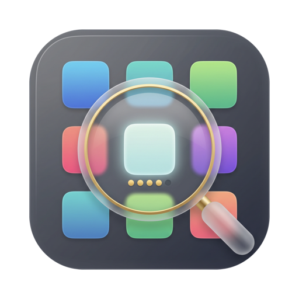
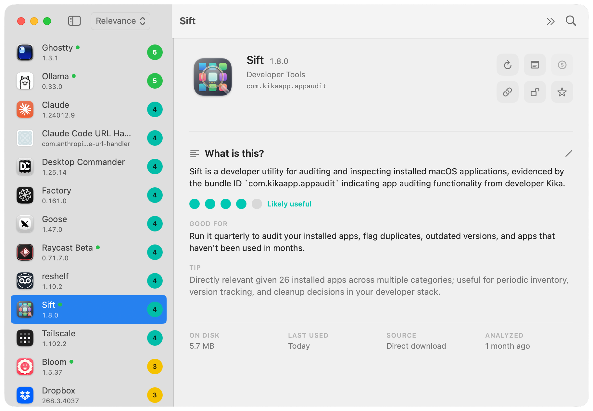
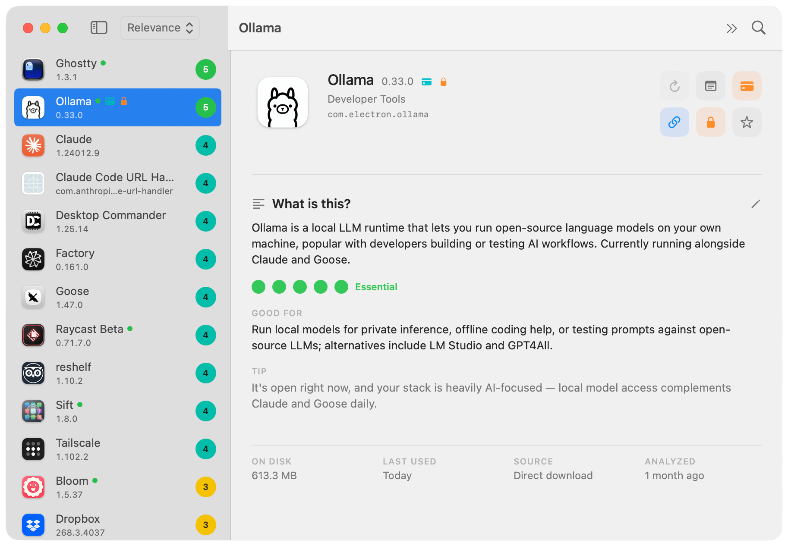
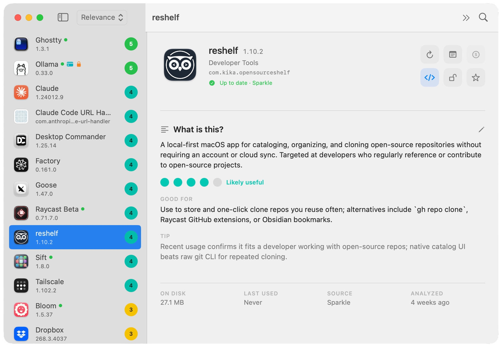

<div align="center">



# Sift

### A local-first macOS app auditor

**Know what every app on your Mac is, what it costs you, and whether it earns its place.**

Sift is a native SwiftUI app for macOS that inventories installed applications, explains each one in plain English with a local LLM (Ollama by default), scores how well it fits *your* workflow, tracks licences and subscriptions, finds updates, and uninstalls leftovers to the Trash — without a Sift account, and without telemetry.

[](https://www.apple.com/macos/)
[](#requirements)
[](https://swift.org)
[](https://developer.apple.com/xcode/swiftui/)
[](CHANGELOG.md)
[](docs/RELEASE.md)
[](#privacy)
[](LICENSE)

[Download the notarized DMG](https://github.com/aka-kika/sift/releases/latest) · [What it does](#what-sift-does) · [Privacy](#privacy) · [Docs](#docs)

</div>

<p align="center">
  
</p>

<p align="center"><sub>Sift reading Sift. A 1–5 relevance score, a plain-English explanation, a concrete use, and the quiet facts Finder never surfaces.</sub></p>

---

## What Sift does

Your `/Applications` folder fills up faster than you can remember why. Sift reads it the way you would if you had the time — one app at a time, with context.

For every installed Mac app it answers three questions:

| Question | What you get |
|---|---|
| **What is this?** | One or two plain sentences. No marketing copy, no "appears to be a utility". |
| **Good for** | A concrete use, written against the apps you actually run. |
| **Do you need it?** | A 1–5 relevance score with the reasoning behind it. |

Then it keeps the answers, so the second launch is instant and the audit becomes something you consult rather than something you rerun.

<p align="center">
  
</p>

<p align="center"><sub>Relevance is personal. Ollama is a 5 here because this Mac already runs Claude and Goose — the same app can be a 2 on someone else's.</sub></p>

## Why it's different

**The analysis is grounded, not guessed.** There is no bundled catalogue of "known apps". Every judgement is made from real evidence: the app's own metadata, notes you write, the fetched words of the maker's own page, and — for apps you build yourself — a local project folder's README and manifests. If Sift doesn't know something, it says so and offers to go find out.

**It scores against you, not against the average user.** Relevance is measured against a workflow profile Sift derives from your machine — what categories you have, what you opened recently, what's running now.

**It runs on your Mac.** [Ollama](https://ollama.com) is the default provider, so prompts never leave the machine. Anthropic and OpenAI are available if you want them, under your own key, entirely by choice. There is no Sift server, no account, no telemetry.

<p align="center">
  
</p>

<p align="center"><sub>Updates from Sparkle, the Mac App Store, and Homebrew casks show up on the same page as the explanation.</sub></p>

## Features

### Audit and scoring
- 1–5 relevance score, explanation, best use, and the reason behind the score — all in one model call
- Automatic workflow profile from your installed apps, with an optional override you write yourself
- **Lock** an analysis to freeze it against rescans, model changes, and re-runs
- Sort by relevance, updates, last used, or name; filter to favourites or your own apps
- Full audit **export to CSV** — licence keys are never included

### Money, in one place
- One **License cube** per app whose face tells you the state at a glance: subscription, App Store, lifetime, one-time, annual, free
- Licence keys in the **macOS Keychain**, device-bound, never iCloud-synced, revealed only with **Touch ID**
- Subscriptions with amount, currency, cycle, renewal date, and a countdown that turns orange as it approaches
- **License Vault** (`⇧⌘L`) — everything you've bought, split into installed and no-longer-installed, so a key never disappears with the app

### Updates
- Detects available versions via the **Mac App Store**, **Sparkle** feeds, and **Homebrew** casks
- Open the update, run `brew upgrade --cask`, or acknowledge it and move on

### Uninstall that doesn't lose the receipt
- Right-click → **Uninstall…** finds the bundle plus every leftover matched to its bundle ID across twelve Library locations, each with a size and the reason it matched
- **Everything goes to the Trash** — recoverable by design; nothing is deleted
- The licence record **survives the uninstall** and stays in your vault
- Works on Mac App Store apps by handing root-owned bundles to Finder rather than asking you for a password
- Apple system apps and Sift itself are refused outright

## Requirements

| | |
|---|---|
| **OS** | macOS 14.0 or later |
| **Chip** | Apple Silicon |
| **Model** | [Ollama](https://ollama.com) running locally — or an Anthropic / OpenAI / ollama.com key |

Analysis needs a model. Scanning, licences, updates, and uninstall work without one.

## Install

Download the notarized DMG from the [latest release](https://github.com/aka-kika/sift/releases/latest), open it, and drag Sift to Applications.

```bash
# the local model Sift uses by default
brew install ollama
ollama serve
ollama pull llama3.2
```

Building from source? See **[docs/environment.md](docs/environment.md)** — zero to running on a fresh machine.

## Privacy

Sift collects nothing. No analytics, no crash reporting, no accounts, and no server of its own exists.

- **Analysis** runs locally on Ollama by default. Switching to a cloud provider is your explicit choice, under your own API key.
- **Licence keys** live in the macOS Keychain, never in the app's database and never in a CSV export.
- **Network calls** happen only for update checks, fetching a page you linked, and a cloud provider you opted into.
- **Nothing is deleted.** The uninstall sweep is a Trash move you can undo.

Full declaration, including every OS permission and how to revoke it: **[docs/privacy.md](docs/privacy.md)**.

## FAQ

**Does Sift send my app list anywhere?**
No. With the default local Ollama provider nothing leaves your Mac. If you switch to Anthropic or OpenAI, only that app's analysis prompt goes to the provider you chose, under your own key.

**Do I need Ollama?**
For analysis, yes — or a cloud API key instead. Without either, Sift still scans, lists, tracks licences, checks updates, and uninstalls; only the AI explanation and score are unavailable.

**Is it safe to uninstall with Sift?**
Everything moves to the Trash, so any sweep is reversible until you empty it. Apple system apps and Sift itself are protected, and each leftover is listed with the reason it matched before you confirm.

**What happens to my licence keys when I remove an app?**
They stay. The record moves to "No longer installed" in the License Vault and moves back if you reinstall — that's the whole reason the vault exists.

**Why does it ask to control Finder?**
Only when uninstalling a Mac App Store app. Store bundles are owned by root and macOS permits only Finder to move them, so Sift asks Finder to do it. No password passes through Sift. The reasoning is written up in [ADR 0003](docs/decisions/0003-finder-does-privileged-trash-moves.md).

**Does it work on Intel Macs?**
The shipped build is Apple Silicon. The source builds for Intel, but it isn't tested there.

**Is Sift free?**
Yes, and open source under the MIT licence.

**Is this AppAudit?**
Same app. The product name is Sift; the bundle ID stays `com.kikaapp.appaudit` so existing SwiftData and Keychain data survive the rename.

## Docs

| | |
|---|---|
| [User and developer guide](docs/README.md) | Every feature, menu, and shortcut |
| [Feature list](FEATURES.md) | The short version |
| [Architecture](docs/ARCHITECTURE.md) | How it's put together |
| [Privacy and permissions](docs/privacy.md) | What it touches and why |
| [Environment setup](docs/environment.md) | Zero to running |
| [Release checklist](docs/RELEASE.md) | Signing and notarization |
| [Changelog](CHANGELOG.md) · [Decisions](docs/decisions/) · [Releases](docs/releases/) · [Roadmap](docs/roadmap.md) | The trail |

## Built with

Swift 5.9 · SwiftUI · SwiftData · AppKit · LocalAuthentication (Touch ID) ·
Keychain Services · Ollama · SwiftPM. No third-party dependencies.

## Contributing

Bug reports and ideas are welcome — see [CONTRIBUTING.md](CONTRIBUTING.md) and the
issue templates. Security reports go through [SECURITY.md](SECURITY.md), privately.

## Note on naming

The product is **Sift**. For continuity the bundle identifier remains
`com.kikaapp.appaudit` and the Swift sources live under `Sources/AppAudit/` —
this keeps existing user data (the SwiftData store and Keychain licence keys)
working across the rename. These internal identifiers are not user-visible.

## License

MIT — see [LICENSE](LICENSE).

With thanks to two projects that shaped Sift: the leftover-discovery strategy is
adapted from [uninstally](https://github.com/gostonx/uninstally) (MIT, © 2026
Codenta), and [Mole](https://github.com/tw93/Mole) (GPL-3.0, © tw93) is the
reason Sift shows a running-app indicator and sorts by last-used date. Mole is
written in Go and none of its source is present here — those behaviours are
independent Swift implementations against Apple's own APIs.

<div align="center">

Made by **Kika** · [akakika.com](https://akakika.com) · [@akakikaaa](https://x.com/akakikaaa)

</div>
